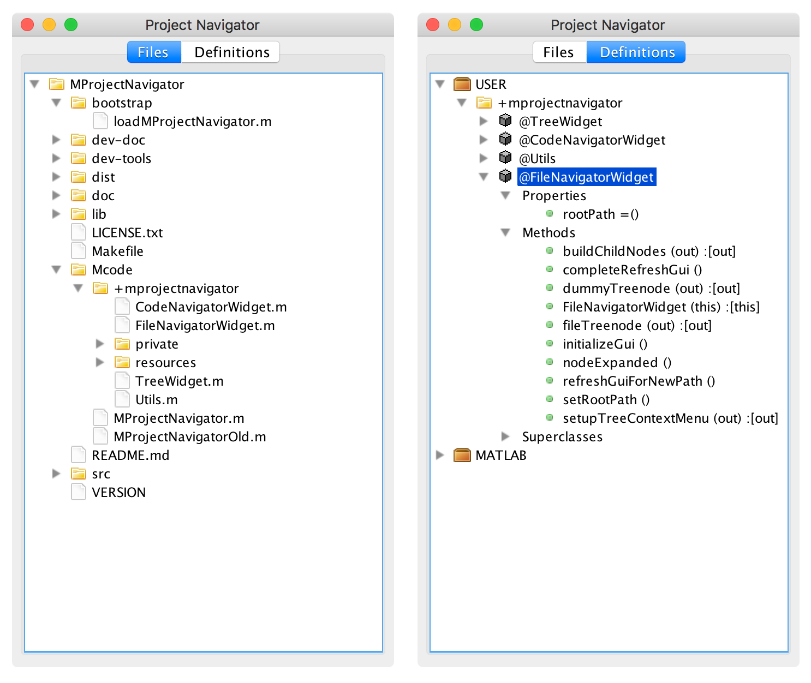

MProjectNavigator
=====================



MProjectNavigator is a GUI tool for viewing a Matlab project's source tree. This is for use within the Matlab desktop IDE.

When working in an IDE, I like having a tool that displays the entire source tree of the project I'm working on. Matlab's "Current Directory" window comes close, but not quite, because its file location isn't fixed, and I tend to bounce around a lot of directories when doing Matlab development. MProjectNavigator provides a view of your source tree that is fixed and independent of the current working directory. It also provides a view that lets you browse in terms of the Matlab package/namespace hierarchy, instead of the filesystem layout.

## Caution: Undocumented Features!

This program makes extensive use of undocumented, unsupported Matlab features. Use at your own risk, do not use in production code, and use caution when using its source code as an example.

## Requirements

Requires Matlab.

This program is developed and tested on Matlab R2016b and R2017b. It may work on other versions as well. I don't intend to support releases prior to R2016b if there are any significant differences, though.

I use this primarily on Mac, but it should work on all OSes that Matlab runs on. If you find an issue on another OS, feel free to [report it as a bug](https://github.com/apjanke/MProjectNavigator/issues).

## Installation

* Download the distribution and unzip it (or clone the repo from GitHub)
* Add this to your `startup.m` file:
```
cd </path/to/unzipped/distribution>/MProjectNavigatory/bootstrap
loadMProjectNavigator
```

Alternately, if you don't want to modify your `startup.m` file, you can just run `loadMProjectNavigator` each time you want to use the tool. That function takes care of adding all the paths and other initialization. See it for details.

MLProjectNavigator saves some of its settings in Matlab's prefs() database. If your program state seems to get messed up and you're having problems that persist between Matlab session restarts, you can do a `MLProjectNavigator -deletesettings` to delete all the settings and start over fresh.

## Usage

All usage is done through a single function, `MProjectNavigator`. Call it to display the navigator window, hide it, or configure it.

```
MProjectNavigator               % Displays the tool
MProjectNavigator -hide         % Hides the tool
MProjectNavigator -pin <path>   % Change the pinned directory in the file navigator
```

There's also a keyboard shortcut! Press `Ctrl-Shift-P` to show or hide the navigator window.

All the classes and functions in the `+mprojectnavigator` package are internal implementation details. Don't call them directly.

## Author and Development

MProjectNavigator is written by <a href="https://apjanke.net">Andrew Janke</a>. Source code is available in the <a href="https://github.com/apjanke/MProjectNavigator">MProjectNavigator repo on GitHub</a>.

Bug reports, feedback, feature requests, and minor bug fix PRs are welcome. Please ask first (by [submitting an issue](https://github.com/apjanke/MProjectNavigator/issues)) before doing PRs for new features or behavior changes. This is a personal project, and I'm finicky about its behavior, so I wouldn't want you to waste time writing code that won't be accepted.

See [Developing](doc/Developing.md) for details on hacking MProjectNavigator itself.

See the [CHANGELOG](doc/CHANGELOG.md) for release history details.

## Acknowledgments

I learned how to do the Matlab/Java tree programming from Yair Altman's <a href="https://www.mathworks.com/matlabcentral/fileexchange/14317-findjobj-find-java-handles-of-matlab-graphic-objects">findjobj</a> tool and articles on his <a href="https://undocumentedmatlab.com/">Undocumented Matlab</a> site.

## License

MProjectNavigator is licensed under the 3-Clause BSD License.

This program uses icons from the <a href="http://www.famfamfam.com/lab/icons/silk/">Silk icon set</a> by Mark James. They are licensed under the <a href="https://creativecommons.org/licenses/by/3.0/">Creative Commons Attribution 3.0 License</a>.

## Bugs

I think I have a memory leak somewhere. I occasionally get a Java out of memory error when I've been running it for a while. (Though this usually happens when I've viewed large trees, like the MATLAB class definitions in flat package view.)

The icons don't look quite right on Windows in HiDPI mode (e.g. on a 27" Retina 5K iMac). They're too small.

## Wishlist

Ideally, I'd like the navigators to be dockable Matlab desktop things, like Matlab's Workspace and Current Directory tools are. But I can't figure out how to do that. If you know how, drop me a line!
